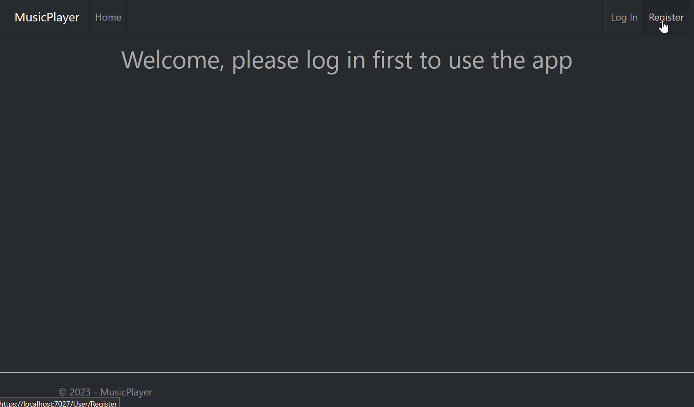
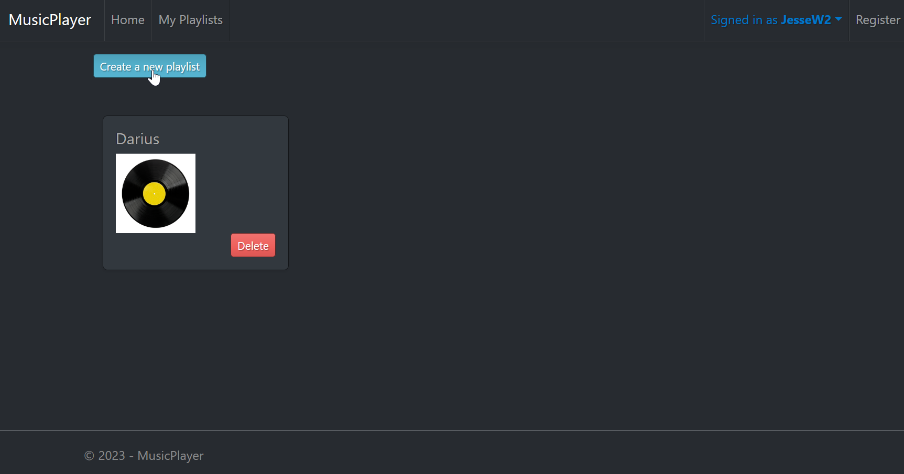
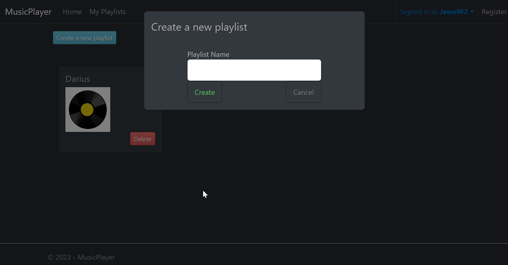
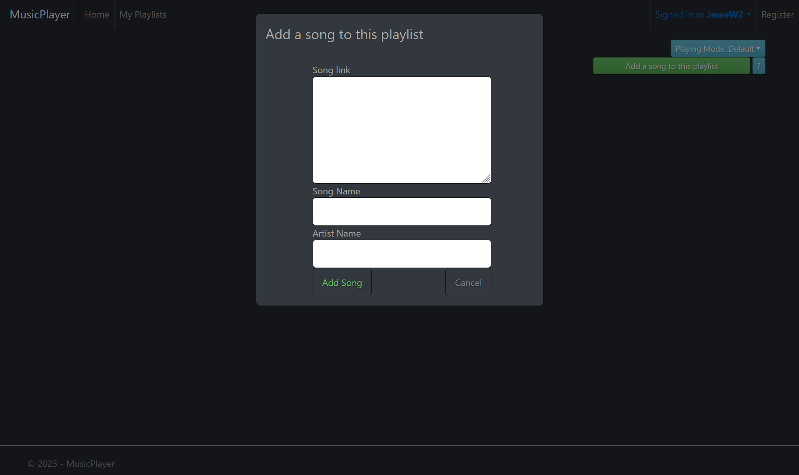
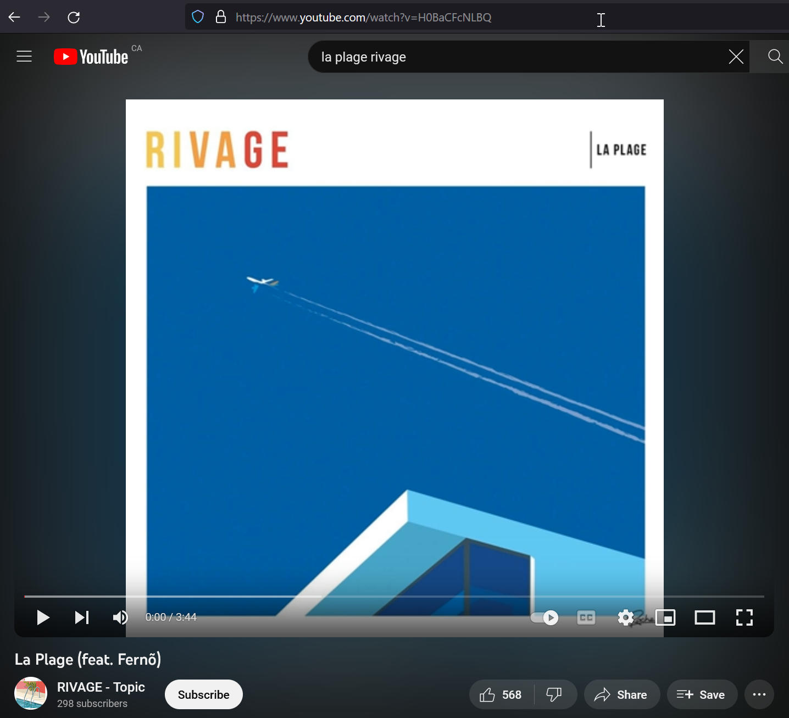
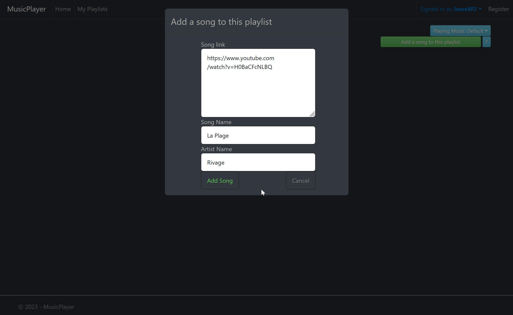
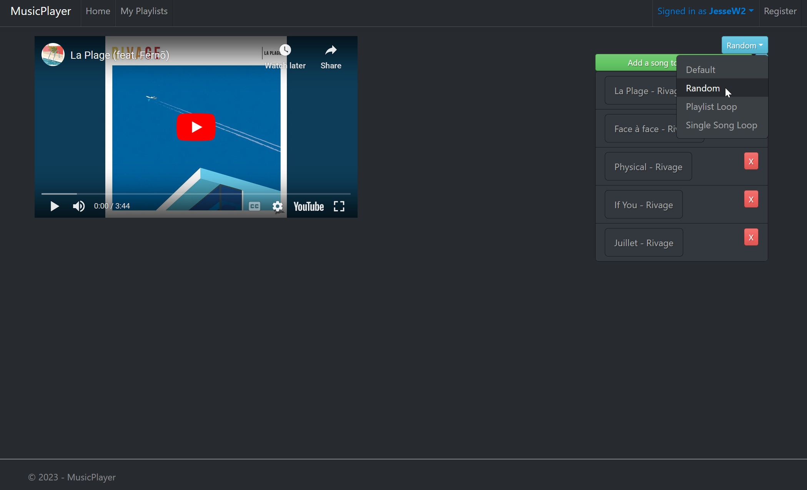

# MusicPlayer

This is a personal project made to play music from YouTube

# Features

1. Create Playlist and add songs to Playlist (Finished)
2. Play music with randomize songs order (Finished)
3. Create rules that link songs playing order (One song must be played after a specific song etc) (In Progress)
4. Get lyrics for a specific song (In Progress)

# How To Use

Go to [here](https://musicplayerapplication.azurewebsites.net/) to access the website

Register or Login if you already have an account on the top right corner

Create a Playlist and Give it a name in the Playlist tab

Click on the Playlist and go inside the playlist, then add a song to your playlist clicking the button on the right

Go to any YouTube music video can copy its url

Paste it into the box and give it a name and artist name

Choose a playlist Mode and start playing music from YouTube with your own playlist!

